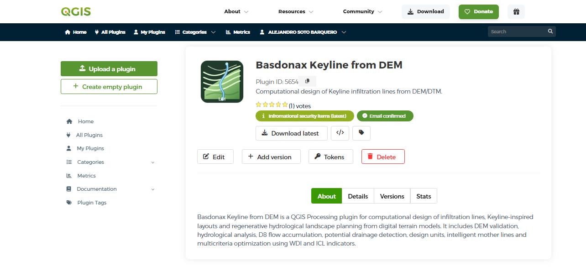

   
 
# Basdonax Keyline from DEM
--------
Basdonax Keyline from DEM** is a QGIS Processing plugin for computational design of LDI / Keyline-inspired infiltration lines from DEM or DTM data. Hosted in the official QGIS repository.
--------
The plugin supports regenerative hydrological landscape design, permaculture, soil conservation, water infiltration planning, agroforestry layout support and agricultural drainage analysis.
--------

## Workflow

--------
Link plugin: https://plugins.qgis.org/plugins/basdonax_keyline_from_dem/

--------

---

## Requirements

- QGIS 3.28 or newer
- Recommended:
  - QGIS 3.40 LTR
  - QGIS 4.x

---
## Main Features

Current version: **0.7.2**

Implemented phases:

1. **Phase 1 - Strengthened geometric engine**
   - DEM validation
   - Contour generation
   - Mother line selection
   - Offset generation
   - Slope profiling
   - Minimum radius evaluation
   - GNSS stakeout points

2. **Phase 2 - Hydrological analysis**
   - D8 hybrid flow direction
   - Priority-Flood filling
   - Flow accumulation
   - Potential drainage detection
   - Hydrological risk classification

3. **Phase 3 - Design Units**
   - Optional user-defined design units
   - Automatic preliminary design units
   - Geomorphometric classification
   - Local spacing and maximum length by unit
   - Functional classification of LDI lines

4. **Phase 4 - Intelligent Mother Line**
   - Mother line selection per design unit
   - Centrality score
   - Coverage score
   - Hydrological score
   - Slope score
   - Radius score
   - Sinuosity score

5. **Phase 5 - Multicriteria Optimization**
   - Hydrological line breaking
   - WDI - Water Distribution Index
   - Target longitudinal grade
   - Near-contour evaluation
   - Redistribution score
   - Optimized ICL penalty

## Outputs

The plugin generates:

- LDI / Keyline lines
- GNSS stakeout points
- Potential drainage lines
- Design Units
- Intelligent Mother Lines

## Recommended Input Data

- DEM / DTM in a projected metric CRS
- For Costa Rica, EPSG:8908 / CRTM05 is recommended
- Optional design mask
- Optional exclusion/restriction layer
- Optional user-defined Design Units

## Recommended DEM Resolution

For operational LDI design:

| Use | Recommended Resolution |
|---|---:|
| Preliminary farm design | 1 - 2 m |
| Detailed design | 0.25 - 1 m |
| RTK construction support | 0.02 - 0.05 m |

## Installation

1) Open QGIS.
2) Go to Plugins → Manage and Install Plugins...
3) Select the All tab (or Not Installed if the plugin has not yet been installed).
4) In the Search box, type "Basdonax Keyline from DEM".
5) Select the plugin from the list.
6) Review the plugin description, version, author, and compatibility information.
7) Click Install Plugin.
8) Wait for the installation to complete.
9) Once installed, the plugin will appear under the Installed tab and on the QGIS toolbar.

## Results
---

---

